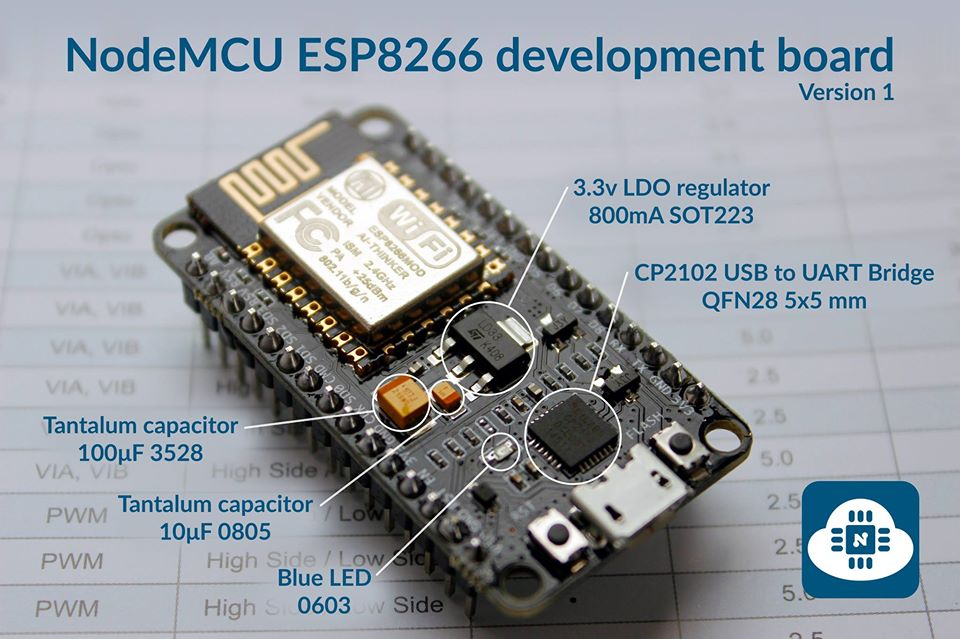

# ESP8266 Wireless MQTT Ultrasound Distance Sensor

### Hardware
#### NodeMCUv2 ESP8266 Development Platform
 
#### HC-SR04 Ultrasonic Sensor
 

  - 20 row breadboard
  - few cables

### Projects Used
 - [WiFi Manager](https://github.com/tzapu/WiFiManager)
